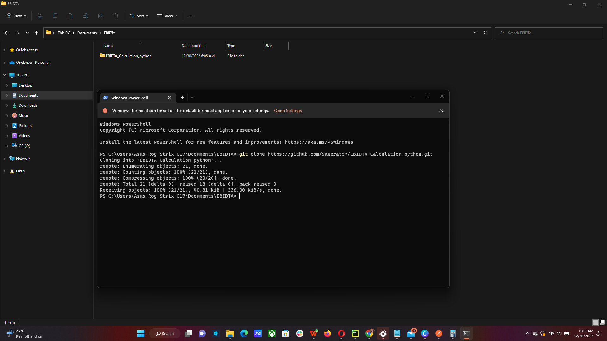
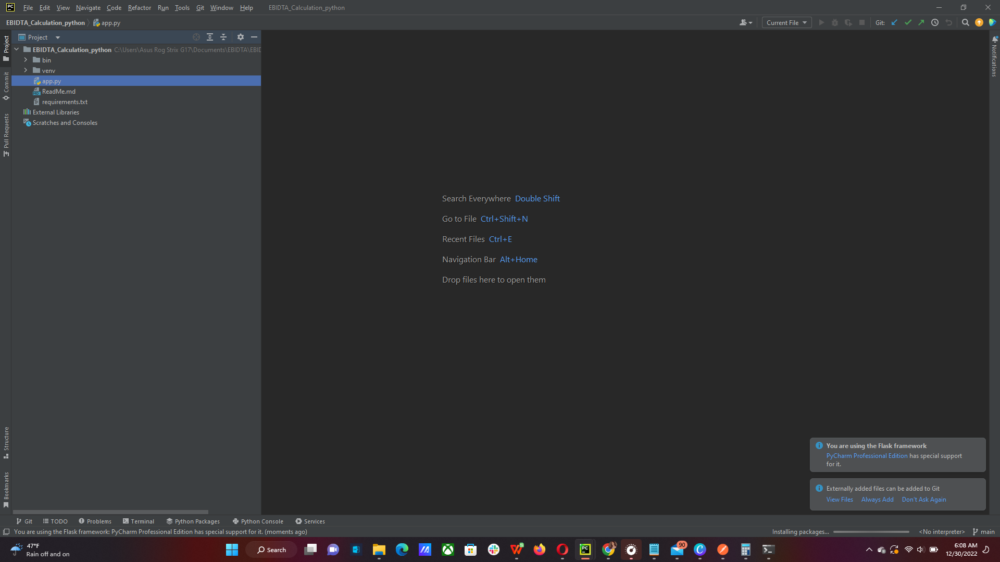
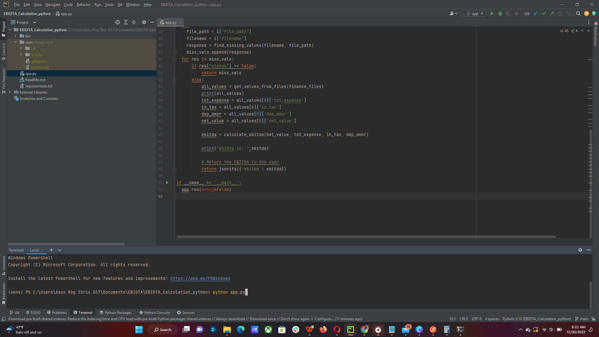
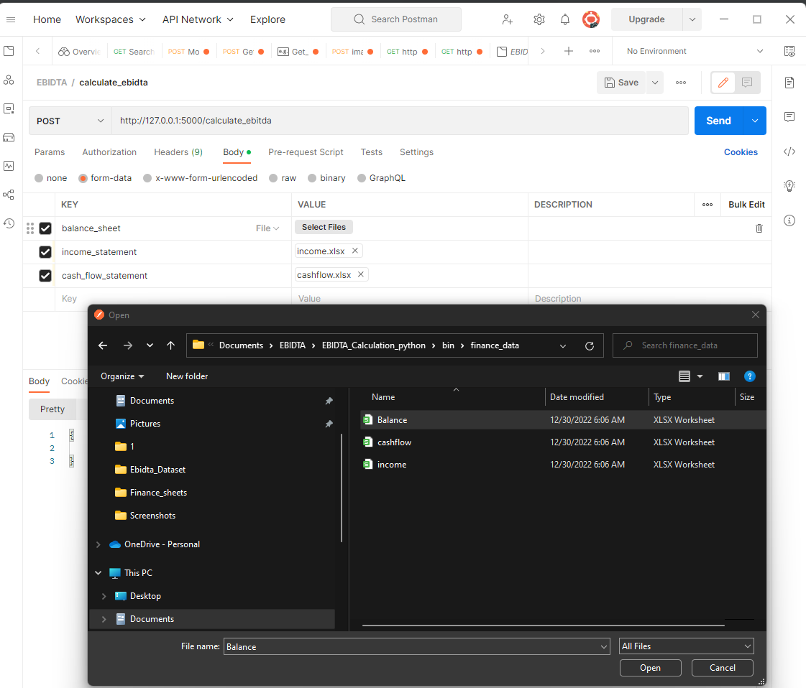
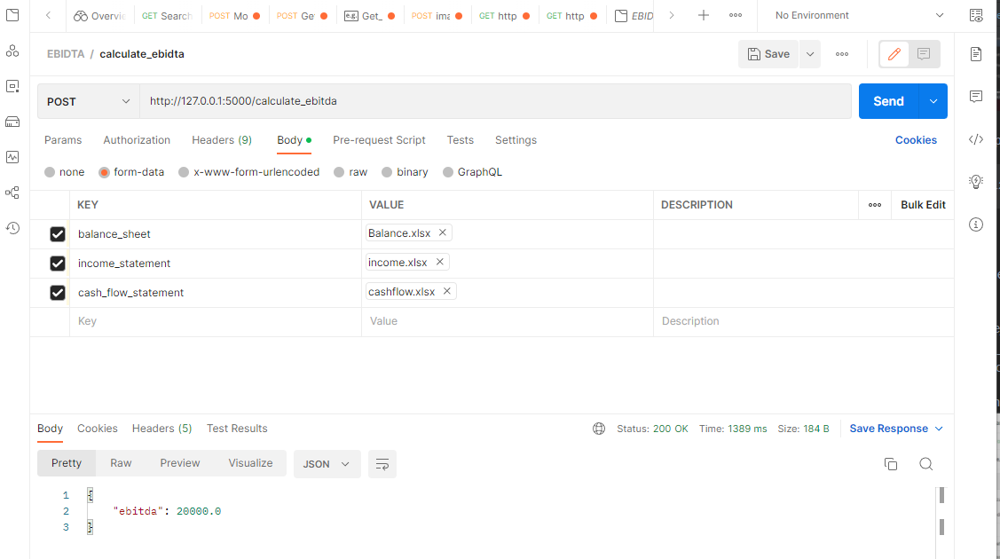

## How it works

- The api takes input of three excel files
- It reads all the keywords data from the excel files
- Then with nltk retrieves all the entities with Named Entity Recognition 
- Then matches the pre-defined keywords for each file with extracted Entities
- If any value is missing in any of the files it returns the response with particular file if missing particular value
- Else it extracts the needed information: Net income, Income taxes payable, Total expense, Depreciation and Amortization from files
- Calculate EBIDTA and return EBIDTA

## How to use EBIDTA_Calculation_python

### Step 01:
Clone the repo in your system
<!-- TOC -->
    * git clone https://github.com/Sawera557/EBIDTA_Calculation_python.git
<!-- TOC -->

### Step 02:
Open the folder in pycharm

Creat virtual enviroment (By default Pycharm creates the virtual environment by itself)

In terminal write the following command to install all necessary libraries
<!-- TOC -->
     pip install -r requirements.txt
<!-- TOC -->

### Step 03:
write following to run the flask app server in the same directory
<!-- TOC -->
     python app.py
<!-- TOC -->

Now the app is running on localhost server
<!-- TOC -->
     http://127.0.0.1:5000
<!-- TOC -->

### Step 04:
Call the api endpoint "calculate_ebidta" in postman
The api endpoint takes in put of three files
- balance_sheet
- income_statement
- cash_flow_statement

Makesure that the files you bowse as input are in the same working directory

The api returns response of calculated ebidta as 

### What kind of keywords we should look for and why?

The compulsory keywords in a balance sheet, income statement, and statement of cash flows depend on the specific financial reporting framework being used.

In general, a balance sheet is a financial statement that reports a company's assets, liabilities, and equity at a specific point in time. Some common keywords that may appear in a balance sheet include:

- Assets
- Liabilities
- Equity
- Current assets
- Non-current assets
- Current liabilities
- Non-current liabilities

An income statement is a financial statement that reports a company's revenues, expenses, and profits over a specific period of time. Some common keywords that may appear in an income statement include:

- Revenues: the income generated by a company's operations
- Expenses: the costs incurred by a company in the process of generating revenues
- Gross profit
- Operating profit
- Net income

A statement of cash flows is a financial statement that reports the inflows and outflows of cash and cash equivalents of a company over a specific period of time. Some common keywords that may appear in a statement of cash flows include:

- Cash inflows
- Cash outflows
- Operating activities
- Investing activities
- Financing activities

It is important to note that the specific keywords that appear in a balance sheet, income statement, and statement of cash flows may vary depending on the financial reporting framework being used. For example, the keywords used in an International Financial Reporting Standards (IFRS) financial statement may be different from those used in a Generally Accepted Accounting Principles (GAAP) financial statement.

